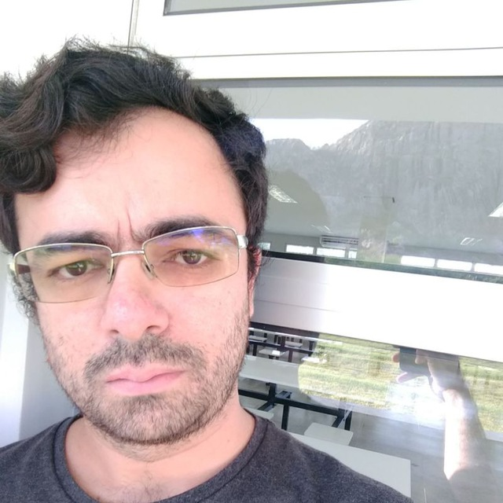

# funcional20201
Repositorio com a resolução de questões vistas na UFC em Quixadá na disciplina de Programação Funcional, durante o semestre 2020.1 com o professor David Sena

# About
Neste repositório postarei soluções e questões propostas durante a disciplina de Programação Funcional, ministrada em 2020.1 na UFC Campus Quixadá pelo professor David Sena Oliveira ( github.com/senapk ) 

